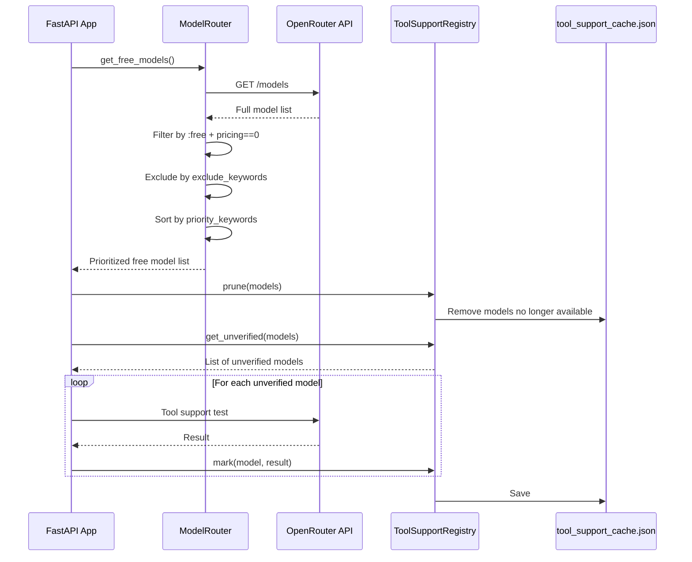
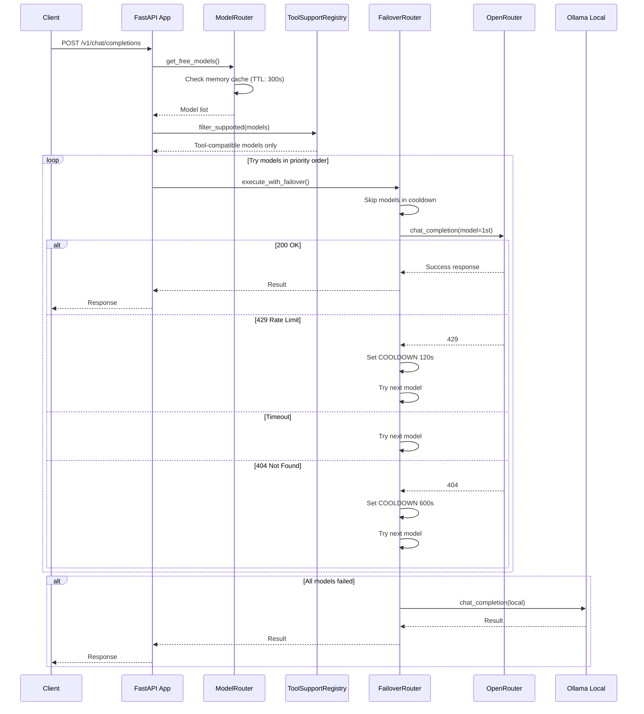
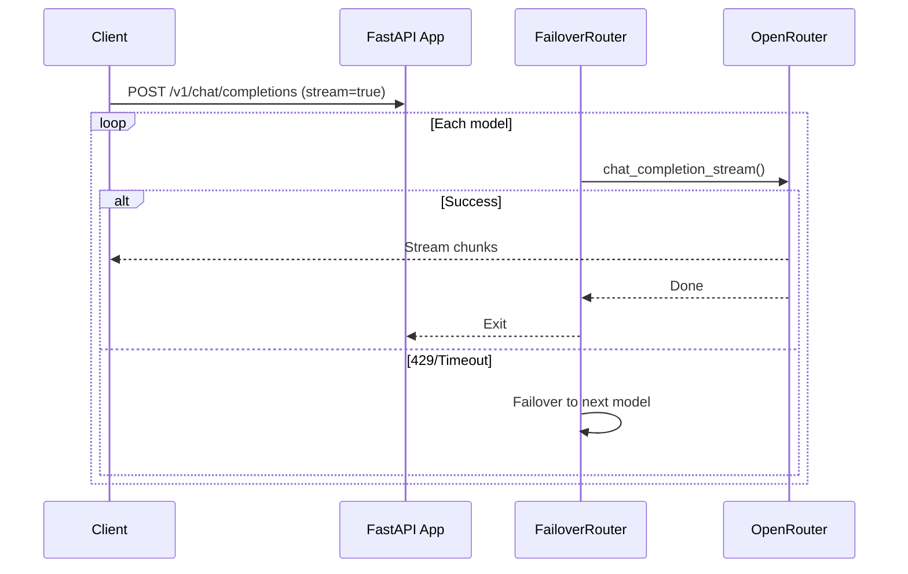
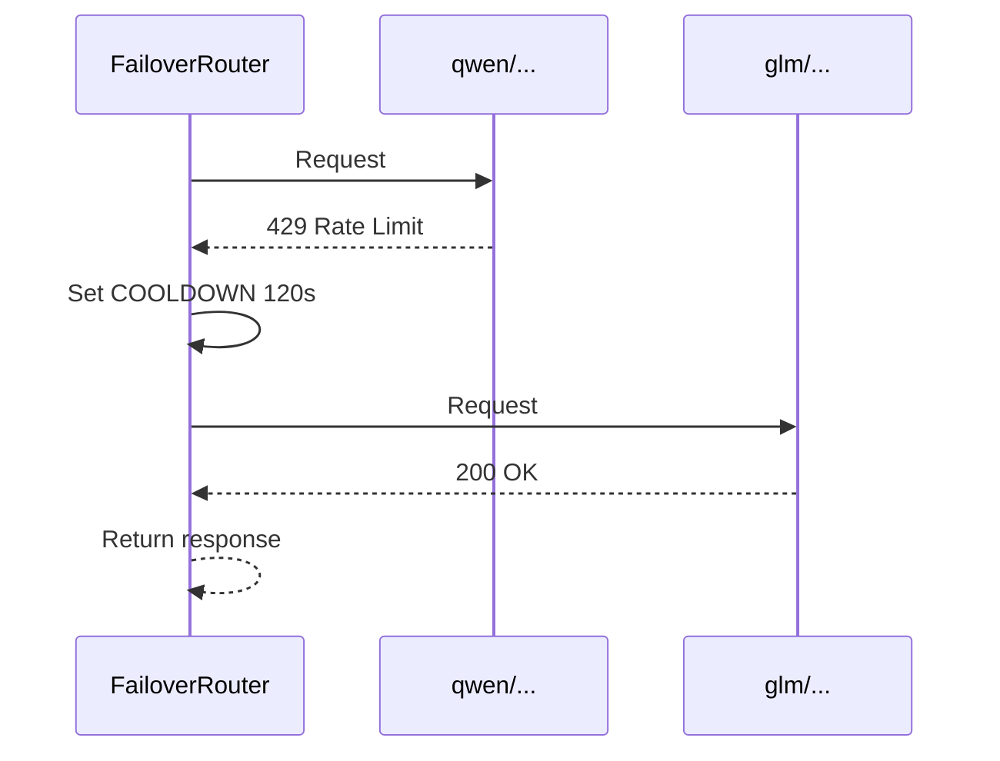

# How It Works

## Overview

Free Model Router is a proxy server that automatically selects and fails over across multiple free AI models.

## Startup Behavior

### Model List Fetch Flow



### Step-by-Step

1. **Fetch models**: Retrieve the full model list from OpenRouter
2. **Filter free models**: Select models with `:free` suffix and pricing == 0
3. **Exclude**: Remove models matching `exclude_keywords` (e.g. dolphin, liquid, arcee)
4. **Sort**: Order by `priority_keywords` priority value (lower = higher priority)
5. **Verify tools**: Test function calling support on unverified models and cache results

---

## Request Handling

### Chat Completion Request



### Streaming Request



---

## Cache Summary

| Cache             | Location                           | Content                     | TTL / Persistence             |
| ----------------- | ---------------------------------- | --------------------------- | ----------------------------- |
| **Model list**    | Memory (`_cached_models`)          | Free model list             | 300 seconds                   |
| **Tool support**  | `tool_support_cache.json`          | Per-model tool support flag | Persistent                    |
| **Cooldown**      | Class variable (`_cooldown_until`) | Rate-limited model state    | In-process (reset on restart) |
| **Ghost models**  | Memory cache                       | 404-detected models         | 600 seconds                   |
| **Known vendors** | `known_vendors.json`               | List of notified vendors    | Persistent                    |

---

## Failover Example

Actual log output and corresponding behavior:

```
2026-04-29 00:13:38,349 [WARNING] 429 Rate limit   qwen/qwen3-next-80b-a3b-instruct:free
2026-04-29 00:13:38,349 [INFO] COOLDOWN 120s   qwen/qwen3-next-80b-a3b-instruct:free
2026-04-29 00:13:50,310 [INFO] 200 OK (stream)   z-ai/glm-4.5-air:free
```



---

## Configuration (`config.yaml`)

```yaml
global:
  timeout_seconds: 15
  model_cache_ttl_seconds: 300
  rate_limit_cooldown_seconds: 120
  not_found_cooldown_seconds: 600
  verify_tool_support: true
  cache_dir: .cache

enabled_providers:
  - openrouter
  - groq
  # - cerebras
  # - sambanova
  - ollama

providers:
  openrouter:
    base_url: https://openrouter.ai/api/v1
    priority_keywords:
      - keywords: [next, 80b, air]
        priority: 1
      - keywords: [nano, mini, lite, flash]
        priority: 98
    exclude_keywords: [dolphin, liquid, arcee]

  groq:
    base_url: https://api.groq.com/openai/v1
    min_context_window: 120000
    min_max_completion_tokens: 30000

  cerebras:
    base_url: https://api.cerebras.ai/v1

  sambanova:
    base_url: https://api.sambanova.ai/v1
    min_context_window: 128000
    min_max_completion_tokens: 8192

  ollama:
    base_url: http://localhost:11434
    model: phi3.5:latest
```

- **`enabled_providers`**: List of active providers (comment out to disable)
- **`exclude_keywords`**: Model name keywords to exclude from routing
- **`priority_keywords`**: Priority rules — lower value = higher priority
- **`rate_limit_cooldown_seconds`**: How long to skip a model after a 429
- **`not_found_cooldown_seconds`**: How long to skip a model after a 404

---

## Summary

1. **Startup**: Fetch free models, sort by priority, verify tool support
2. **Per request**: Try models in order, auto-skip on 429
3. **Fallback**: Route to local Ollama when all cloud models fail
4. **Cooldown**: Automatically skip rate-limited models for 120 seconds
5. **Ghost model handling**: 404 errors trigger 600s cooldown to exclude removed models
