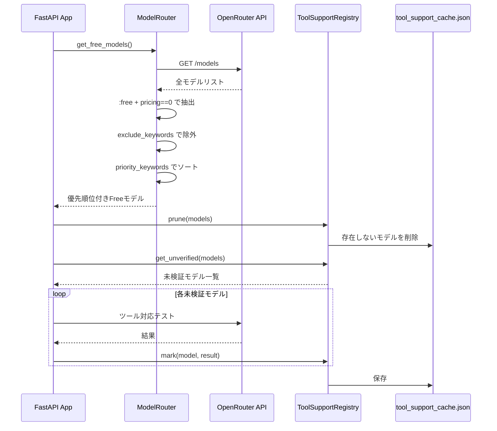
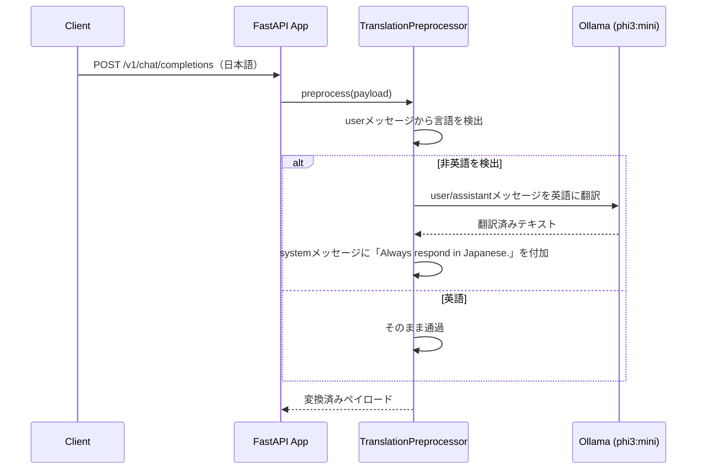
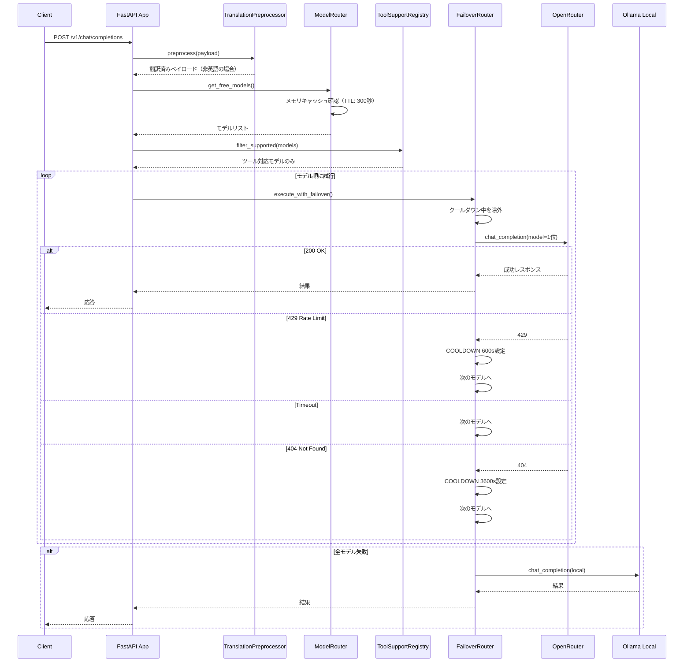
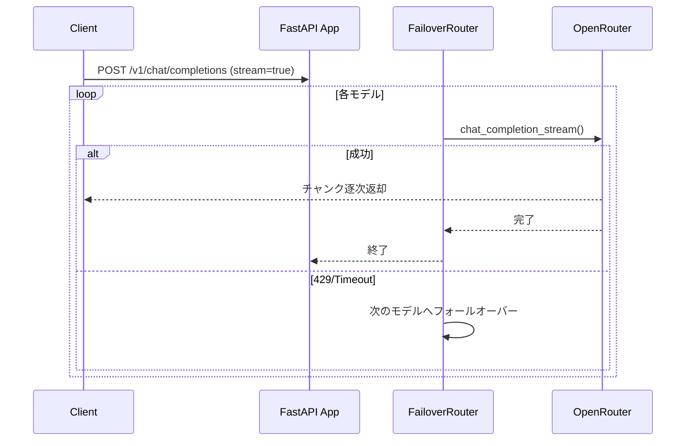

# システム動作解説

## 概要

Free Model Router は、複数の無料AIモデルを自動的に選択・フォールオーバーするプロキシサーバーです。

## 初回起動時の動作

### モデルリスト取得フロー



### 処理の詳細

1. **モデル取得**: OpenRouterから全モデルを取得
2. **Free抽出**: `:free` suffix + pricingが0のモデルを抽出
3. **除外**: `exclude_keywords`（dolphin, liquid, arcee等）に該当するモデルを除外
4. **ソート**: `priority_keywords` のpriority値でソート（小さいほど優先）
5. **ツール検証**: 未検証モデルのツール対応をテストし永続キャッシュ

---

## リクエスト時の動作

### 翻訳プリプロセッサ（オプション）

`preprocess.enable: true` の場合、英語以外のメッセージをクラウドへ転送する前にローカルOllamaで英語に翻訳します。



- `user` と `assistant` のみ翻訳。`system` メッセージは変更しません
- 言語検出は `user` ロールのみで行います（`system` の英語ツール指示による誤検出を防止）
- 翻訳には `preprocess.model`（小型・高速）を使用、フォールバック推論には `providers.ollama.model`（大型）を使用

### チャット補完リクエスト



### ストリーミングリクエスト



---

## キャッシュ機構

| キャッシュ　　　　　 | 場所　　　　　　　　　　　　　  | 内容　　　　　　　　  | TTL/永続性　　　　　　　　　　  |
| -------------------- | ------------------------------- | --------------------- | ------------------------------- |
| **モデルリスト**　　 | メモリ (`_cached_models`)　　　 | Freeモデル一覧　　　  | 300秒　　　　　　　　　　　　　 |
| **ツール対応**　　　 | `tool_support_cache.json`　　　 | モデルごとの対応有無  | 永続　　　　　　　　　　　　　  |
| **クールダウン**　　 | クラス変数 (`_cooldown_until`)  | 429モデルの休止状態　 | プロセス内（再起動でリセット）  |
| **存在しないモデル** | メモリキャッシュ　　　　　　　  | 404/422検出モデル　　 | 3600秒（1時間）　　　　　　　　 |
| **既知ベンダー**　　 | `known_vendors.json`　　　　　  | 通知済みベンダー一覧  | 永続　　　　　　　　　　　　　  |

---

## フォールオーバーの動作例

実際のログと対応する動作：

```
2026-04-29 00:13:38,349 [WARNING] 429 Rate limit   qwen/qwen3-next-80b-a3b-instruct:free
2026-04-29 00:13:38,349 [INFO] COOLDOWN 600s   qwen/qwen3-next-80b-a3b-instruct:free
2026-04-29 00:13:50,310 [INFO] 200 OK (stream)   z-ai/glm-4.5-air:free
```


---

## 設定ファイル (`config.yaml`)

```yaml
global:
  timeout_seconds: 15
  model_cache_ttl_seconds: 300
  rate_limit_cooldown_seconds: 600
  not_found_cooldown_seconds: 3600
  verify_tool_support: true
  cache_dir: .cache

enabled_providers:
  - openrouter
  - groq
  # - cerebras
  # - sambanova
  - ollama

providers:
  openrouter:
    base_url: https://openrouter.ai/api/v1
    priority_keywords:
      - keywords: [next, 80b, air]
        priority: 1
      - keywords: [nano, mini, lite, flash]
        priority: 98
    exclude_keywords: [dolphin, liquid, arcee]

  groq:
    base_url: https://api.groq.com/openai/v1
    min_context_window: 120000
    min_max_completion_tokens: 30000

  cerebras:
    base_url: https://api.cerebras.ai/v1

  sambanova:
    base_url: https://api.sambanova.ai/v1
    min_context_window: 128000
    min_max_completion_tokens: 8192

  ollama:
    base_url: http://localhost:11434
    model: qwen2.5-coder:14b  # クラウド全滅時の最終フォールバック用

preprocess:
  enable: true
  model: phi3:mini            # 翻訳専用の小型・高速モデル
  translate_timeout_seconds: 30
```

### キー設定の説明

- **`enabled_providers`**: 有効なプロバイダーのリスト（コメントアウトで無効化）
- **`exclude_keywords`**: 除外するモデル名のキーワード
- **`priority_keywords`**: 優先順位付けルール（priority値が小さいほど先頭）
- **`rate_limit_cooldown_seconds`**: 429発生時の休止時間（デフォルト: 600秒、10分）
- **`not_found_cooldown_seconds`**: 404/422発生時の休止時間（デフォルト: 3600秒、1時間）
- **`preprocess.model`**: 翻訳用Ollamaモデル（小型・高速推奨）。未指定時は `providers.ollama.model` にフォールバック

---

## まとめ

1. **起動時**: Freeモデルを取得・整列・ツール検証
2. **翻訳**: 有効時、英語以外の入力をローカルOllamaで英語に翻訳してからクラウドへ転送
3. **リクエスト時**: 上位モデルから順に試行、429は自動休止
4. **フォールバック**: 全モデル失敗時はローカルOllamaへ
5. **クールダウン**: 429モデルを600秒間（10分）自動スキップ
6. **存在しないモデル対応**: 404/422エラー時は3600秒クールダウン（1時間）で削除済み/利用不可モデルを回避
