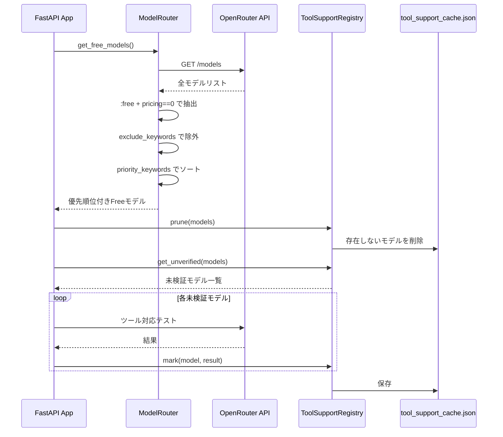
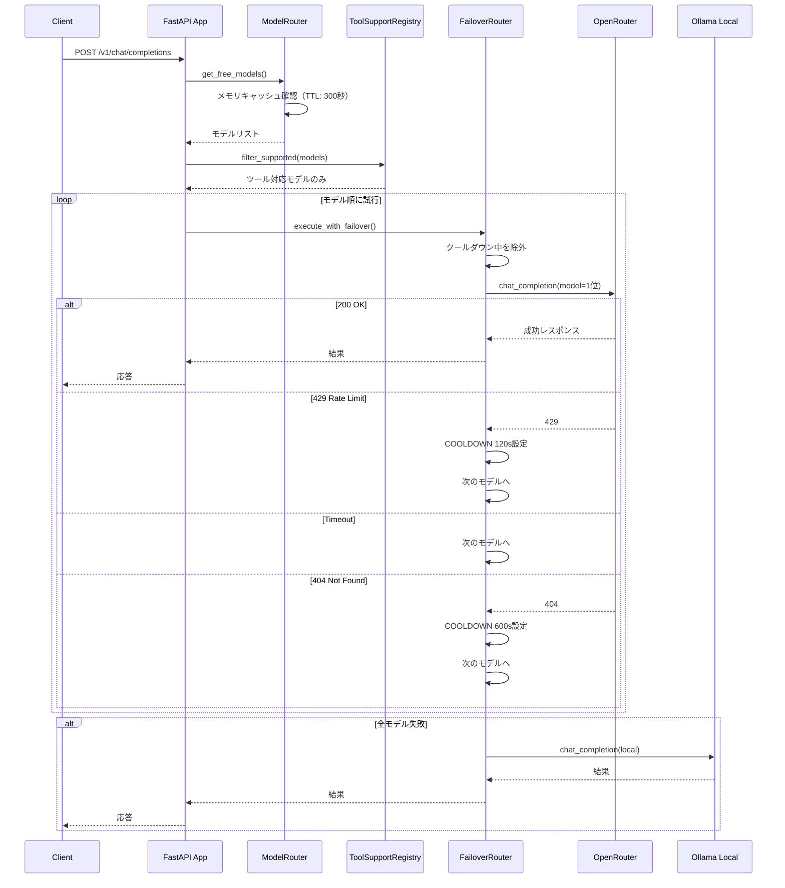
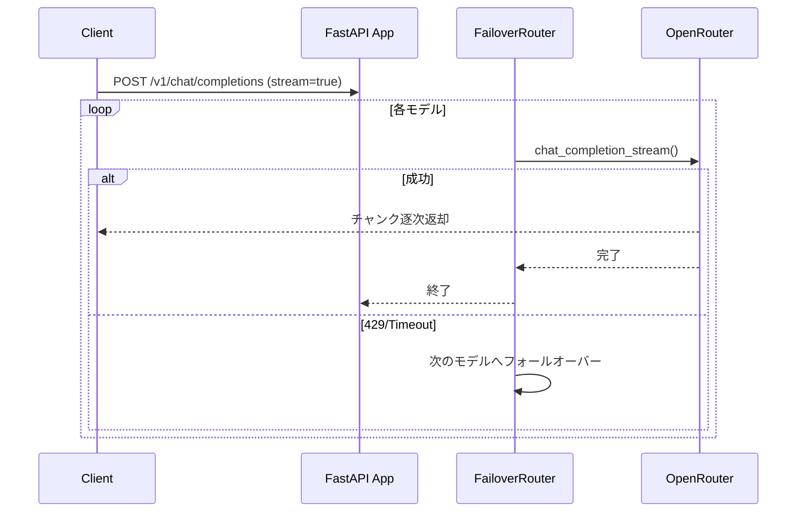
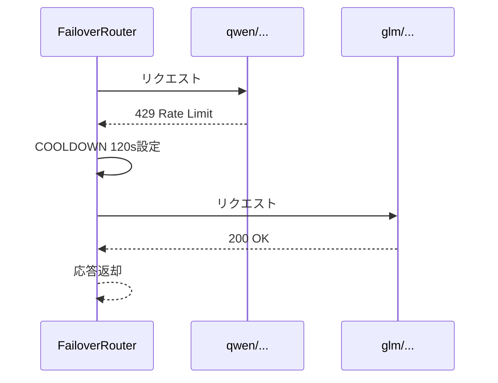

# システム動作解説

## 概要

OpenRouter Routing Proxy は、複数の無料AIモデルを自動的に選択・フォールオーバーするプロキシサーバーです。

## 初回起動時の動作

### モデルリスト取得フロー



### 処理の詳細

1. **モデル取得**: OpenRouterから全モデルを取得
2. **Free抽出**: `:free` suffix + pricingが0のモデルを抽出
3. **除外**: `exclude_keywords`（dolphin, liquid, arcee等）に該当するモデルを除外
4. **ソート**: `priority_keywords` のpriority値でソート（小さいほど優先）
5. **ツール検証**: 未検証モデルのツール対応をテストし永続キャッシュ

---

## リクエスト時の動作

### チャット補完リクエスト



### ストリーミングリクエスト



---

## キャッシュ機構

| キャッシュ　　　　　 | 場所　　　　　　　　　　　　　 | 内容　　　　　　　　 | TTL/永続性　　　　　　　　　　 |
| ----------------------| --------------------------------| ----------------------| --------------------------------|
| **モデルリスト**　　 | メモリ (`_cached_models`)　　　| Freeモデル一覧　　　 | 300秒　　　　　　　　　　　　　|
| **ツール対応**　　　 | `tool_support_cache.json`　　　| モデルごとの対応有無 | 永続　　　　　　　　　　　　　 |
| **クールダウン**　　 | クラス変数 (`_cooldown_until`) | 429モデルの休止状態　| プロセス内（再起動でリセット） |
| **存在しないモデル** | メモリキャッシュ　　　　　　　 | 404検出モデル　　　　| 600秒　　　　　　　　　　　　　|
| **既知ベンダー**　　 | `known_vendors.json`　　　　　 | 通知済みベンダー一覧 | 永続　　　　　　　　　　　　　 |

---

## フォールオーバーの動作例

実際のログと対応する動作：

```
2026-04-29 00:13:38,349 [WARNING] 429 Rate limit   qwen/qwen3-next-80b-a3b-instruct:free
2026-04-29 00:13:38,349 [INFO] COOLDOWN 120s   qwen/qwen3-next-80b-a3b-instruct:free
2026-04-29 00:13:50,310 [INFO] 200 OK (stream)   z-ai/glm-4.5-air:free
```



---

## 設定ファイル (`config.json`)

```json
{
  "timeout_seconds": 15,
  "model_cache_ttl_seconds": 300,
  "exclude_keywords": [ "dolphin", "liquid", "arcee" ],
  "priority_keywords": [
    { "keywords": [ "next", "80b", "air" ], "priority": 1 },
    { "keywords": [ "nano", "mini", "lite", "flash" ], "priority": 98 }
  ],
  "rate_limit_cooldown_seconds": 120,
  "not_found_cooldown_seconds": 600
}
```

### キー設定の説明

- **`exclude_keywords`**: 除外するモデル名のキーワード
- **`priority_keywords`**: 優先順位付けルール（priority値が小さいほど先頭）
- **`rate_limit_cooldown_seconds`**: 429発生時の休止時間（秒）

---

## まとめ

1. **起動時**: Freeモデルを取得・整列・ツール検証
2. **リクエスト時**: 上位モデルから順に試行、429は自動休止
3. **フォールバック**: 全モデル失敗時はローカルOllamaへ
4. **クールダウン**: 429モデルを120秒間自動スキップ
5. **存在しないモデル対応**: 404エラー時は600秒クールダウンで除外済みモデルを回避
